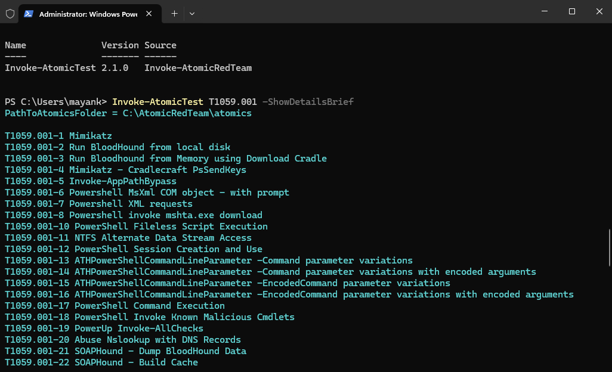
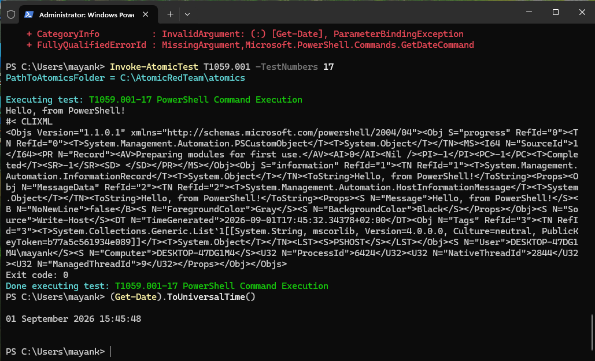
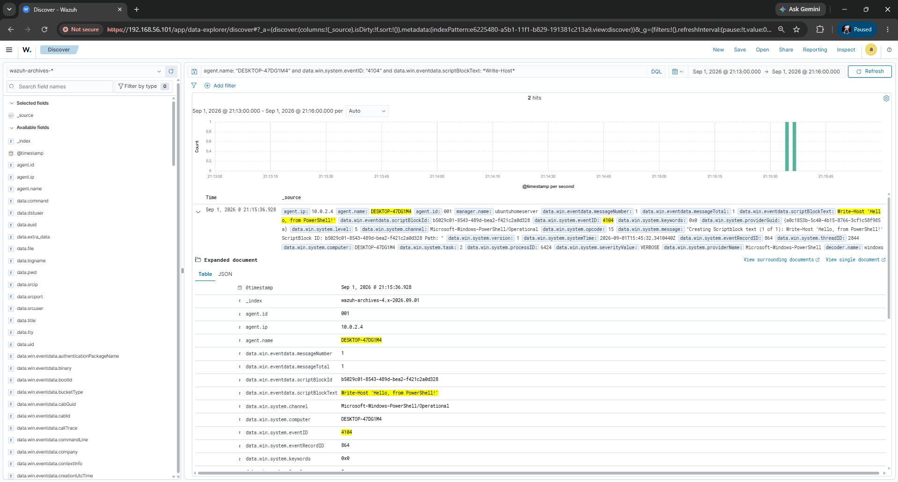
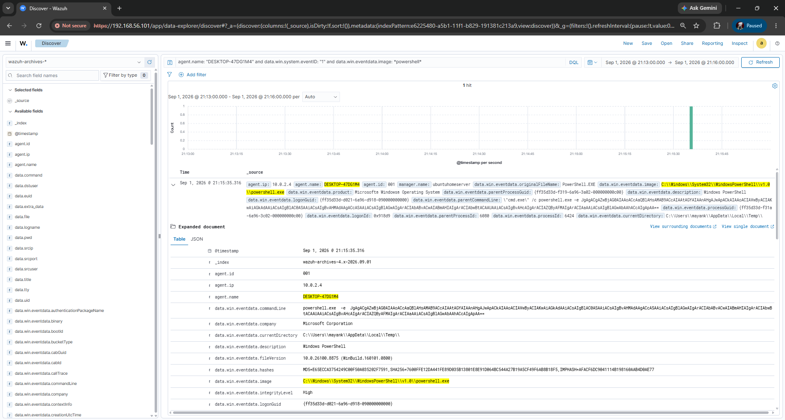
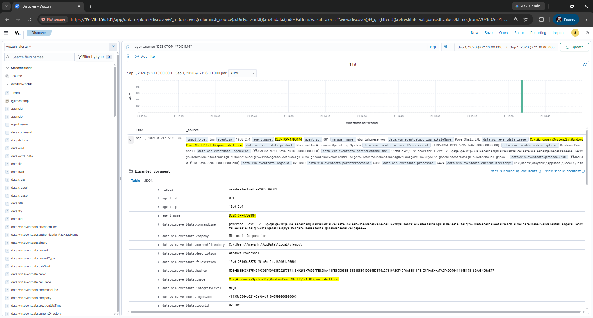
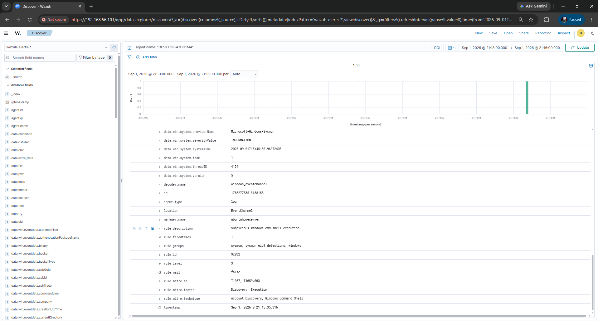

# T1059.001 - PowerShell

**Tactic:** Execution
**Outcome:** Detected, but by accident. See notes.

## What I ran

Atomic Red Team test 17 for T1059.001, "PowerShell Command Execution". The payload comes from Red Canary's 2021 Threat Detection Report.

```powershell
Invoke-AtomicTest T1059.001 -TestNumbers 17
```

T1059.001 has 22 atomic tests. I picked test 17 because it runs entirely locally with no network dependency, so any missing telemetry would point at my pipeline rather than at a failed download.



Inspecting the test before running it shows what it actually does:



The test runs this:

```
powershell.exe -e JgAgACgAZwBjAG0AIAAoACcAaQBlAHsAMAB9ACcAIAAtAGYAIAAnAHgAJwApACkAIAAoACIAVwByACIAKwAiAGkAdAAiACsAIgBlAC0ASAAiACsAIgBvAHMAdAAgACcASAAiACsAIgBlAGwAIgArACIAbABvACwAIABmAHIAIgArACIAbwBtACAAUAAiACsAIgBvAHcAIgArACIAZQByAFMAIgArACIAaAAiACsAIgBlAGwAbAAhACcAIgApAA==
```

Decoded, that is:

```powershell
& (gcm ('ie{0}' -f 'x')) ("Wr"+"it"+"e-H"+"ost 'H"+"el"+"lo, fr"+"om P"+"ow"+"erS"+"h"+"ell!'")
```

Three layers of obfuscation stacked on top of a payload that just prints "Hello, from PowerShell!":

1. **Base64 encoding** via `-e`, so nothing readable appears on the command line.
2. **Alias construction.** `('ie{0}' -f 'x')` builds the string `iex` at runtime, and `gcm` resolves it to `Invoke-Expression`. The literal string `iex` never appears.
3. **String concatenation.** `"Wr"+"it"+"e-H"+"ost"` assembles `Write-Host` from fragments, so the cmdlet name never appears either.

Each layer defeats a different naive signature. The payload is harmless, the delivery is real tradecraft.

## Telemetry

Two events from `wazuh-archives-*`, same process, PID 6424. This pair is the point of the whole technique.

**PowerShell Event ID 4104** (`t1059-001-4104.json`)

```
scriptBlockText: Write-Host 'Hello, from PowerShell!'
systemTime: 2026-09-01T15:45:32.341Z
processID: 6424
```



Fully decoded. All three obfuscation layers gone.

**Sysmon Event ID 1** (`t1059-001-sysmon1.json`)

```
commandLine: powershell.exe -e JgAgACgAZwBjAG0A...
parentCommandLine: "cmd.exe" /c powershell.exe -e JgAgACgAZwBjAG0A...
parentProcessId: 6080
processId: 6424
currentDirectory: C:\Users\mayank\AppData\Local\Temp\
integrityLevel: High
```



Still encoded. Same action, same process, two very different views of it.

## Detection

A built-in rule fired.



```
rule.id: 92032
rule.description: Suspicious Windows cmd shell execution
rule.level: 3
rule.groups: sysmon, sysmon_eid1_detections, windows
rule.mitre.id: T1087, T1059.003
rule.mitre.tactic: Discovery, Execution
```



No custom rule was written for this technique, so there is no false positive assessment.

## Notes

**Where the payload becomes readable matters more than where it starts.** At process creation, Sysmon only ever sees the base64 blob — the `-e` argument is opaque by design. The plaintext `Write-Host 'Hello, from PowerShell!'` shows up only in the 4104 event, because script block logging records what the PowerShell engine actually executes *after* it has decoded and deobfuscated the command, not the string that was passed on the command line. A detection that inspects command lines alone would have captured the encoded blob and understood nothing about what it did. One process, PID 6424, produces both views at once — the encoded one and the decoded one — and that pair is the clearest single argument I have for keeping script block logging enabled.

**The alert that fired was a coincidence, not a detection of this technique.** Rule 92032 is a generic signature for suspicious `cmd.exe` activity. What tripped it was the `cmd.exe /c powershell.exe ...` wrapper that Atomic Red Team uses to launch its tests — not anything about the PowerShell payload itself. The rule never looks at the `-e` flag, the base64, or the layered obfuscation. Run the same encoded command directly from a PowerShell prompt, with no `cmd.exe` in front of it, and nothing fires. The green alert is real, but it is catching the delivery scaffolding, not the attack.

**The alert files this under the wrong technique.** Rule 92032 carries a MITRE mapping of T1059.003 (Windows Command Shell) and T1087 (Account Discovery). The test I detonated is T1059.001 (PowerShell). So on the dashboard's ATT&CK view this event lands on techniques I never ran, while T1059.001 — the thing that actually executed — still reads as uncovered. Here the coverage map is not just incomplete, it is actively misleading.

**The severity is far too low for what happened.** Level 3 is the informational floor of the Wazuh scale. The event it is rating is an obfuscated, base64-encoded payload running out of `AppData\Local\Temp` at high integrity — precisely the profile you would want escalated. At level 3 it would never surface in a real alert queue; it would sit unread under higher-priority noise.

**Bottom line.** This technique gets marked *detected*, but the label flatters the actual coverage. A rule fired, but it fired on the wrapper, tagged the wrong ATT&CK IDs, and rated itself as background noise. The proper fix is a purpose-built rule keyed on `powershell.exe` with `-e` or `-EncodedCommand` in the command line, so the technique is caught on its own terms instead of by accident — and scored at a level that reflects encoded execution from a temp directory.

## Limitations

- One test out of the 22 available for T1059.001. Other tests use download cradles or in memory execution and may produce different results.
- The direct execution case (no cmd wrapper) is untested, so the claim that nothing would fire is a hypothesis rather than a measured result.
- Atomic Red Team runs from an excluded folder, so Defender was not evaluating the payload the way it would in a real environment.
