# T1218.011 - Rundll32

**Tactic:** Defense Evasion
**Outcome:** Blocked by Defender, detected on the attempt.
**Detection:** Custom rule 100010, level 10.

## What I ran

Atomic Red Team test 5 for T1218.011, `ieadvpack.dll` execution. It uses signed, Microsoft-supplied `rundll32.exe` to run an INF file, a LOLBin technique documented in LOLBAS.

```powershell
Invoke-AtomicTest T1218.011 -TestNumbers 5
```

T1218.011 has 16 tests.

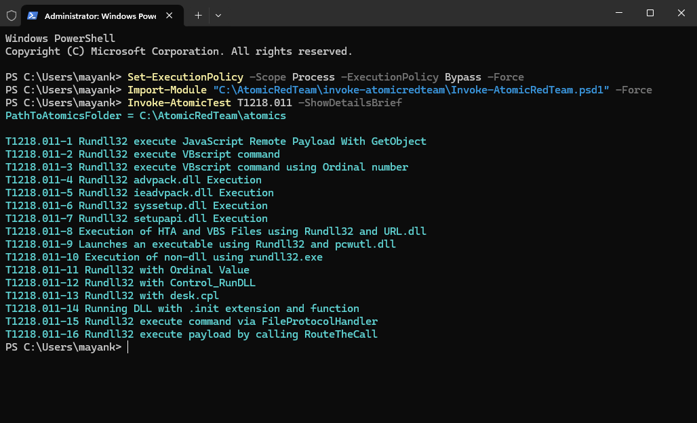

I started with test 2, the `vbscript:` protocol handler variant, and it never executed:

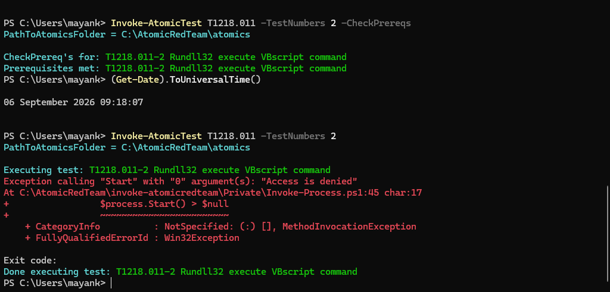

Defender killed it at process creation.

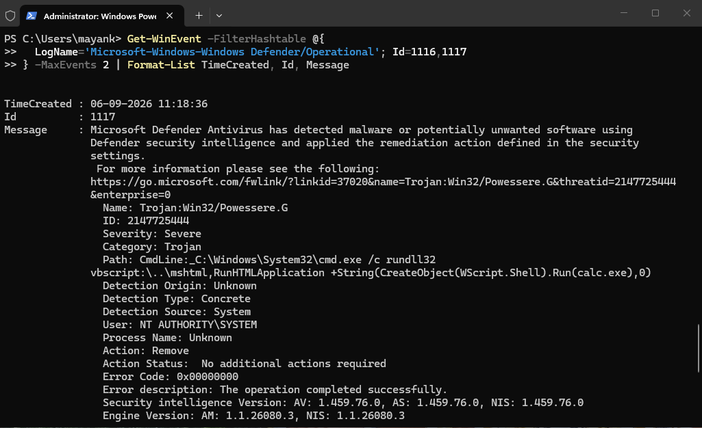

Two details worth noting. The detection was on command line content, not a file (`Path: CmdLine:_...`), and `Trojan:Win32/Powessere.G` is Microsoft's name for Poweliks, the malware family this test replicates. Nothing spawned, so there was no Sysmon telemetry to build a rule on.

I switched to test 5, which invokes a less heavily-signatured export.

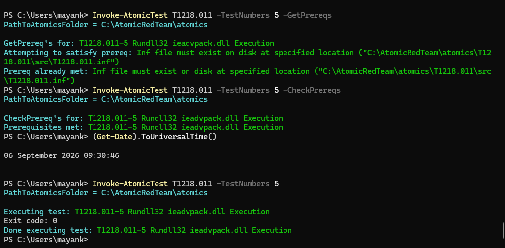

## Telemetry

Test 5 executed. `calc.exe` never launched because Defender quarantined the remote scriptlet the INF pulls down, but `rundll32.exe` reached process creation first, so Sysmon logged it.

```
image:            C:\Windows\System32\rundll32.exe
originalFileName: RUNDLL32.EXE
commandLine:      rundll32.exe  ieadvpack.dll,LaunchINFSection "C:\AtomicRedTeam\...\T1218.011.inf",DefaultInstall_SingleUser,1,
parentImage:      C:\Windows\System32\cmd.exe
integrityLevel:   High
```

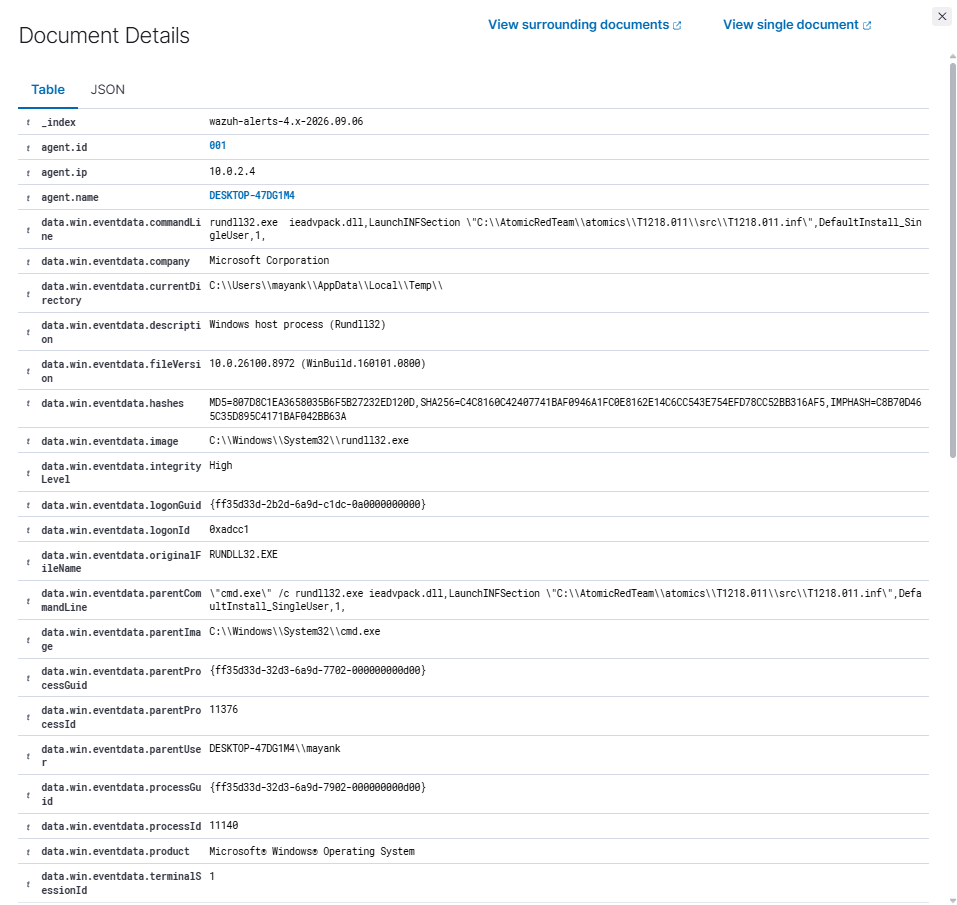

This is the point of the hardened-endpoint approach: the attack failed, and the detection still has something to fire on.

## Detection gap

Before writing a rule, I checked what the built-in ruleset produced.

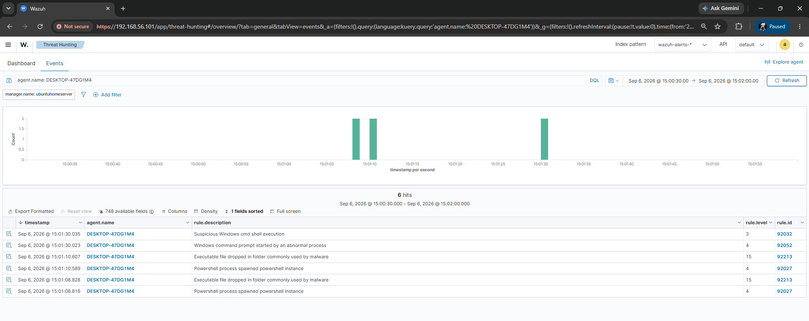

Six alerts in the 90-second window. The two highest-severity ones, both level 15, were false positives:

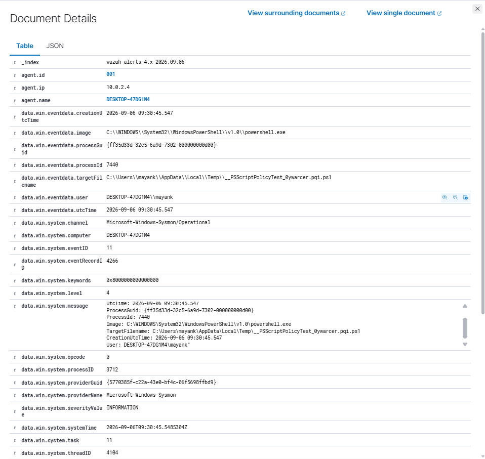

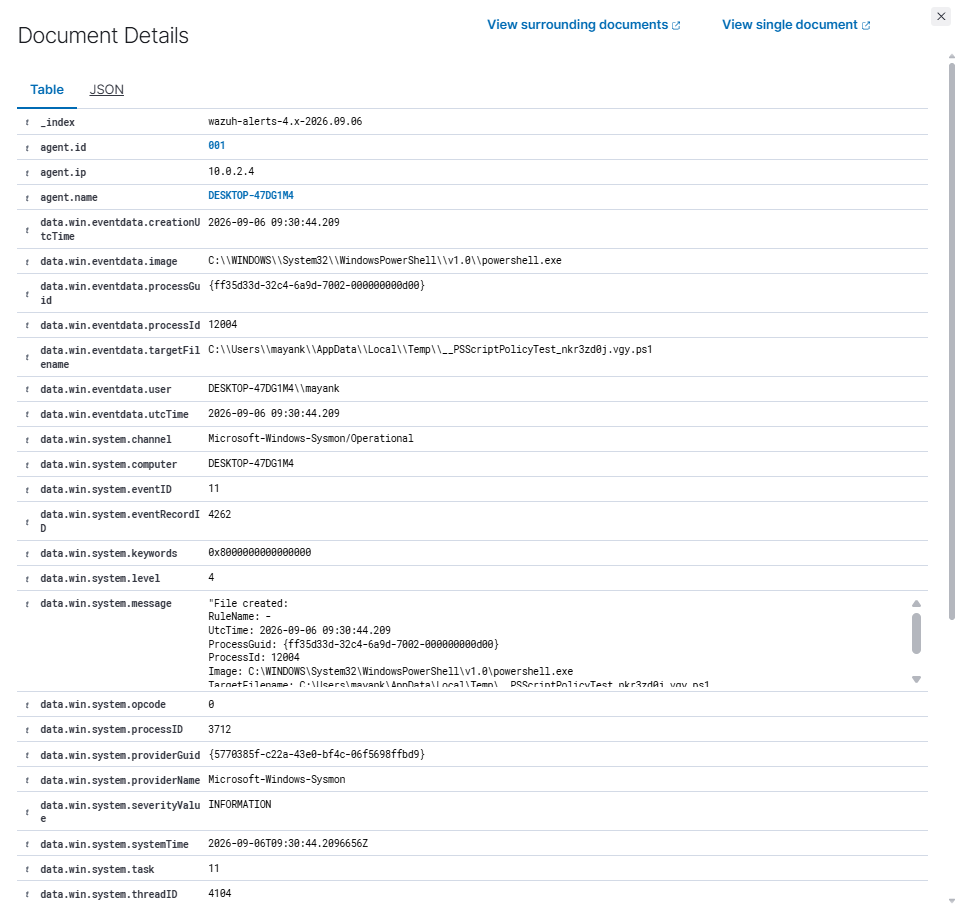

They fired on `__PSScriptPolicyTest_*.ps1` files in Temp, which are PowerShell's own execution-policy probes. Ordinary housekeeping, flagged at the top of the severity scale.

Rule 92032 did match the `rundll32` process, but it describes it as "Suspicious Windows cmd shell execution" and maps it to T1059.003 and T1087. I ran T1218.011. Same problem as technique #1: the alert exists, but it points an analyst at the wrong thing.

## Custom rule 100010

```xml
<rule id="100010" level="10">
  <if_sid>92032,92052</if_sid>
  <field name="win.eventdata.originalFileName" type="pcre2">(?i)^RUNDLL32\.EXE$</field>
  <field name="win.eventdata.commandLine" type="pcre2">(?i)(ie)?advpack\.dll\s*,\s*LaunchINFSection</field>
  <description>Rundll32 LOLBin: INF section execution via advpack/ieadvpack (T1218.011)</description>
  <mitre>
    <id>T1218.011</id>
  </mitre>
</rule>
```

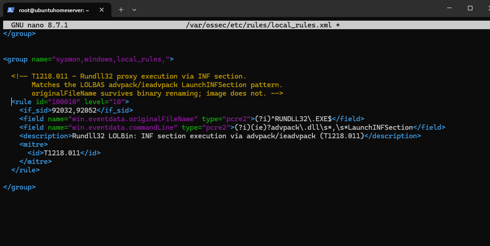

Three decisions behind it:

1. **Match the export, not "suspicious arguments."** `LaunchINFSection` is a specific LOLBAS abuse path. Broader heuristics like "anomalous parent" or "no arguments" would have to survive the legitimate rundll32 traffic below.
2. **`originalFileName` instead of `image`.** It survives renaming the binary. `\s*` handles the double space Sysmon captured.
3. **`if_sid` was necessary, not preferred.** The rule matched in `wazuh-logtest` but never fired in production, because 92032 was matching first and evaluation stopped. Making 100010 a child of 92032/92052 fixed it: the rule now overrides the parent alert instead of competing with it.

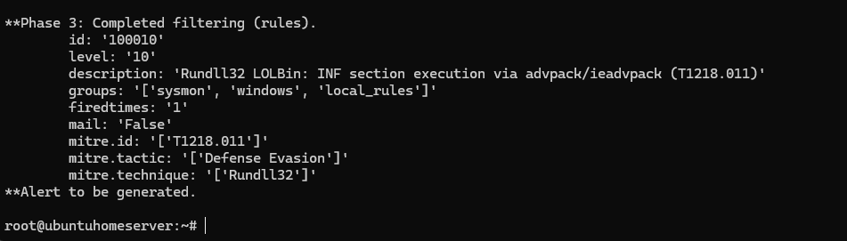

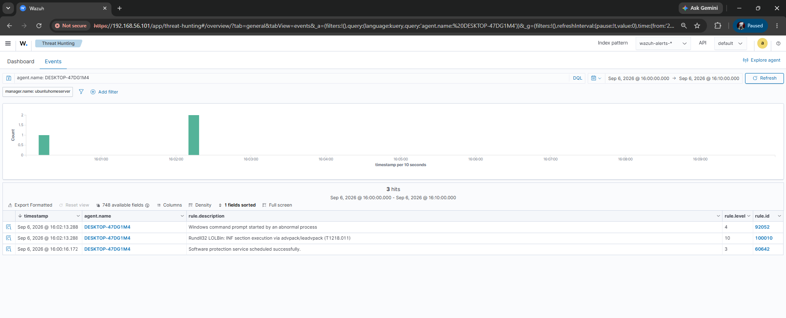

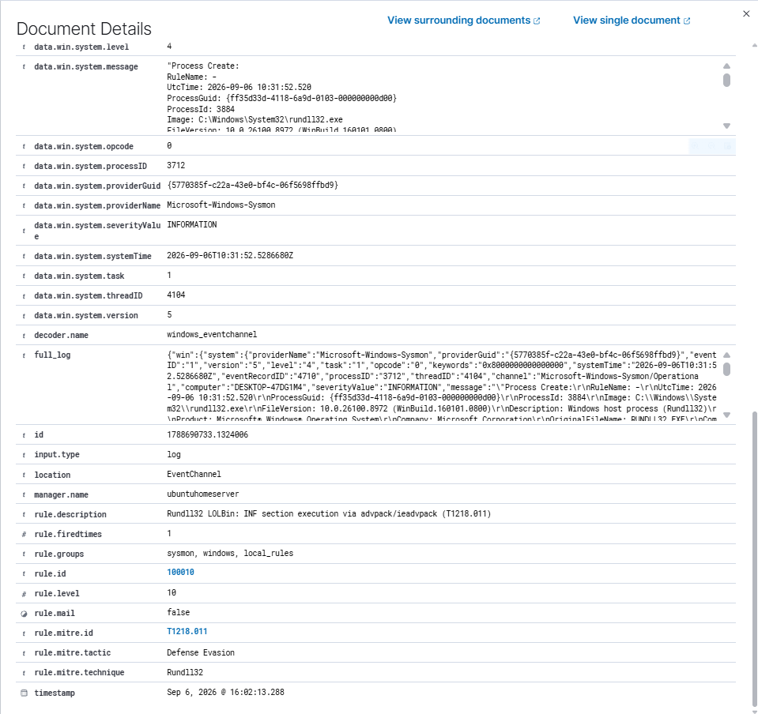

92032 is gone from the window. The rundll32 event now carries the right description, level 10 instead of 3, and the correct ATT&CK mapping.

## False positive assessment

Rundll32 runs constantly on Windows, so this needed measuring rather than asserting. I used the machine normally for ~30 minutes: Control Panel, display settings, printer properties, File Explorer.

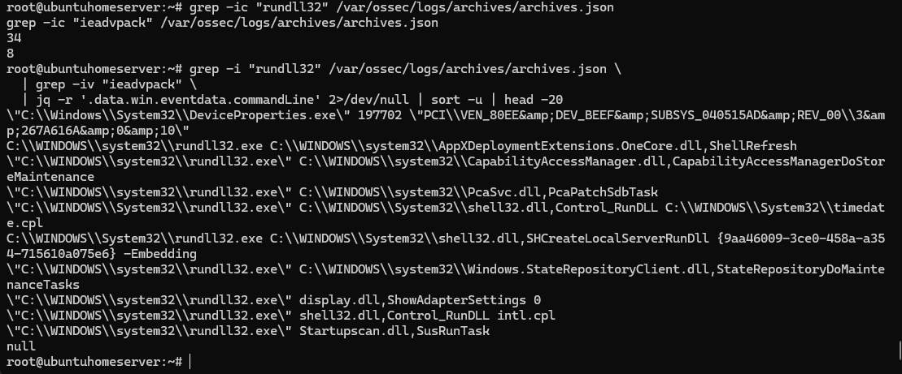

34 rundll32 events in archives, 8 from the attack, 26 legitimate. Rule 100010 fired zero times.

The legitimate invocations:

```
shell32.dll,Control_RunDLL C:\WINDOWS\System32\timedate.cpl
shell32.dll,Control_RunDLL intl.cpl
display.dll,ShowAdapterSettings 0
DeviceProperties.exe
shell32.dll,SHCreateLocalServerRunDll {...} -Embedding
PcaSvc.dll,PcaPatchSdbTask
Startupscan.dll,SusRunTask
CapabilityAccessManager.dll,CapabilityAccessManagerDoStorageMaintenance
Windows.StateRepositoryClient.dll,StateRepositoryDoMaintenanceTasks
AppXDeploymentExtensions.OneCore.dll,ShellRefresh
```

None contains `LaunchINFSection`. This is also the argument for binding to a specific export: a parent-based or no-arguments rule would have had to distinguish attack traffic from `SHCreateLocalServerRunDll ... -Embedding` and several unprompted maintenance tasks.

## Limitations

- `if_sid` narrows coverage. The rule only fires when 92032 or 92052 fires first, so it depends on the `cmd.exe` wrapper Atomic Red Team uses. Direct `rundll32` invocation would not trigger the parent, and this rule would stay silent. A standalone version keyed on Sysmon EID 1 would be more robust but did not fire in this ruleset.
- Two of 16 tests. Test 2 was blocked outright; test 5 executed but its payload was quarantined. The other 14 use different DLLs and exports and may behave differently.
- Covers `advpack`/`ieadvpack` only. `setupapi.dll,InstallHinfSection` and `syssetup.dll,SetupInfObjectInstallAction` are the same technique through different libraries, but both are used by legitimate Windows driver installation, so a rule on them needs a much larger FP baseline than 30 minutes.
- The `C:\AtomicRedTeam` Defender exclusion did not protect either payload. Test 2 was caught on its command line; test 5's scriptlet was caught in `INetCache`, outside the excluded path. Worth knowing that path-based exclusions are narrower than they appear.
- 30-minute FP soak on a single desktop, no domain, no enterprise software. A real environment with management agents or deployment tooling would need a longer baseline.
